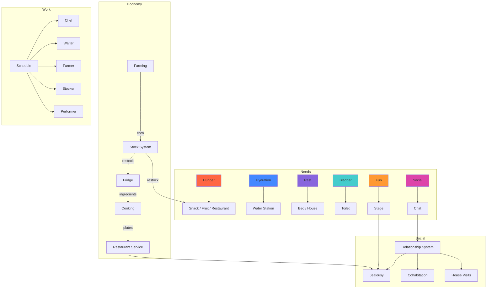

# sim.me — Game Flow Analysis & Suggestions

## Current Game Flows Inventory

After analyzing the full codebase, here's what exists today:

### 🧍 Nirv Needs & Survival Loops

| Need | Decay | Fulfillment | Station | Notes |
|------|-------|-------------|---------|-------|
| **Hydration** | Per-minute | Walk → water station → drink (3s) | `drinking_water` | Queue system with slot layout |
| **Hunger** | Per-minute | Snack machine or fruit crate → wander → eat | `snack_machine`, `fruit_crate` | Fruit crate has 3 concurrent slots; snack is 1-at-a-time |
| **Rest** | Exponential per-minute | Walk → bed → sleep | Bed variants (8 types) | Lying-down pose animation |
| **Bladder** | Per-minute | Walk → toilet → use (3s, hidden sprite) | `portable_toilet` | Queue system |
| **Fun** | Per-minute | Watch stage performance → passive gain | Stages | Match vs no-match interest bonus |
| **Social** | Per-minute | Proximity chat → shared interest talk | N/A (emergent) | Chat bubbles with context-aware lines |

### 🍽️ Restaurant Flow

```
Customer sits in chair → awaits service → waiter picks plate from counter → delivers to table → customer eats → leaves
```

**Sub-flows:**
- **Chef**: `idle → walk to stove → cooking → walk to counter → drop plate → idle`
- **Waiter**: `idle → walk to counter → pick plate → walk to table → deliver → return plate → idle`
- **Reservations**: Counter reservations, table slot reservations, chair-to-table adjacency
- **Fridge stock**: Chefs consume fridge stock; fridges are restocked by corn

### 🌾 Farming Flow

```
Player/Farmer clicks empty crop → seed picker → seeded → (time) → early → (time) → ready → harvest → +1 corn
```

- Only crop: **corn** (single seed type)
- Corn feeds the stock system (restocks snack machines, fruit crates, fridges)
- Farmer bots auto-plant and auto-harvest during work shifts

### 📦 Stock System Flow

```
Stocker bot → find low-stock station → walk to station → restock (spend corn) → idle
```

- Restocks: snack machines, fruit crates, fridges
- Work windows: 9–11am, 3–5pm

### 🎤 Stage / Performance Flow

```
Set attraction (solo/band) → performers walk to stage → audience attracted → audience watches (fun gain) → early leave roll → cycle ends
```

- **Solo** performances: single performer bot
- **Band** performances: multiple bots from a band record
- **Audience affinity**: taste tags matched against act tags → affects early-leave probability
- **Music tags**: pop, rock, pop-rock, romantic, sad, happy, uplifting, energetic, acoustic, jazz
- **Performance cycles** with history tracking

### 🏠 House System Flow

```
Unclaimed house → nearest bot claims → owner visits → owner goes inside
Occupied house → visitor picks known/liked owner → walks to door → rings → owner says "Come in" → visitor enters → social time → exit
```

- House ownership with persistence
- Visitor social bias (relationship-weighted selection)
- Marriage triggers cohabitation (house merge)
- Ignored-at-door causes relationship tension

### 💕 Relationship System

```
acquaintance → (50 affinity) → friend → (3 flirts) → lover → (2 flirt days) → dating → (5 days) → engaged → (7 days) → married
```

- **Affinity** grows from chat ticks, shared interests, first meetings
- **Conflict** from interest mismatch, need stress, jealousy, ignored-at-door
- **Jealousy**: romantic partners get tension when their partner is seen with someone else
- **Decay**: 3+ idle days → affinity loss
- **Cohabitation**: married pairs merge into one house
- **Bond tiers**: none → friend → lover → spouse → housemate

### 💬 Social System

- Proximity-based chat initiation (84px start, 112px keep)
- Eligible states: waiting, seated, watching stage, queuing, eating
- Chat lines: generic, queue-specific, stage-specific, shared-interest
- Social need relief per tick, with relationship bias on start chance

### ⏰ Schedule System

- Templates: **Public** (non-performer) and **Performer** (shifted sleep/work)
- Activities: sleep, morning, work, meal, leisure, home
- Role overlay: chef/waiter/farmer/stocker work windows carved into leisure/morning blocks
- ±15min jitter per bot for staggered behavior

### 🛒 Shop / Placement

- Categories: Build, Farm, Dine, Bedroom, Decor, Misc, Inventory
- Placement modes: objects, buildings, stages (regular + solo)
- Inventory: drag objects from map to store, place from inventory
- Buildings, stages with floor tiles and barriers

---

## Suggested Additions & Tweaks

### 🟢 Category A — High-Impact, Builds on Existing Systems

---

#### 1. **Mood System & Emotional States**

> Currently needs are tracked numerically but there's no visible "mood" that integrates them.

**Concept**: Derive a composite mood (happy / neutral / stressed / miserable) from all need levels. Mood affects:
- Chat line selection (stressed bots complain, happy ones are upbeat)
- Social start chance (stressed bots are harder to approach)
- Work efficiency (stressed chefs cook slower, farmers harvest slower)
- Relationship affinity gain (bad mood dampens gains)

**Implementation**: New `MoodSystem.ts` that reads needs and outputs a `MoodState` enum. BotNirv exposes `getMood()`. UI shows mood emoji on the NirvsPanel.

---

#### 2. **Exercise / Gym Need**

> There's no physical activity need. The fun need is only satisfied by watching stages.

**Concept**: Add an `energy` or `fitness` need that decays over time. Nirvs go to a gym/exercise station to work out. Working out also gives a small fun and social boost (they can chat while exercising).

**New objects**: `gym_bench`, `punching_bag`, `yoga_mat`  
**New states**: `walking_to_gym`, `exercising`  
**Benefit**: Another destination for bots during leisure time, reducing "everyone crowds the stage" syndrome.

---

#### 3. **Recipe Expansion + Ingredient Requirements**

> Only 4 recipes exist (sandwich, soup, pasta, hamburger) and they all auto-cook with no ingredient tracking.

**Concept**: 
- Add 4-6 new recipes with varying quality tiers (quick meals vs. gourmet)
- Each recipe requires specific ingredients from the fridge
- Different fridge types stock different ingredients
- Recipe quality affects satiation gain (gourmet fills more)
- Customer satisfaction rating based on food quality → affects restaurant revenue

**New recipes**: Salad, Steak, Sushi, Pizza, Cake, Smoothie  
**Data change**: `Recipe` gains `ingredients: string[]` and `satiationBonus: number`

---

#### 4. **Day/Night Cycle Visual Feedback**

> The WorldClock exists but there's no visual day/night representation.

**Concept**: Tint the world camera based on time of day:
- 6am–7am: sunrise warm tint
- 7am–5pm: neutral daylight
- 5pm–7pm: golden hour
- 7pm–9pm: dusk blue
- 9pm–6am: night (dark overlay, objects with lights glow)

**Bonus**: Stage performances at night get a "concert lighting" effect (colored spotlights). Bots are more likely to visit stages at night.

---

#### 5. **Bot Personality Traits (beyond interests)**

> Bots have `jealousyTendencyMultiplier`, `badMoodEffect`, and `crowdThreshold` — but these are invisible.

**Concept**: Surface 3-4 personality traits in the UI and make them affect behavior:
- **Introvert/Extrovert**: Affects social need decay rate and chat start chance
- **Early Bird/Night Owl**: Shifts their schedule template ±1 hour
- **Foodie/Frugal**: Prefers restaurant food vs. snack machines
- **Adventurous/Homebody**: Explores further from waypoints vs. stays near home

**UI**: Show on NirvsPanel as small badges/icons per bot.

---

### 🟡 Category B — Medium Impact, New Features

---

#### 6. **Park / Garden Leisure Zones**

> During leisure time, bots just wander on their waypoint loop. There's no "hang out" destination.

**Concept**: Placeable park benches and garden areas that act as leisure magnets:
- Bots during `leisure` activity are attracted to parks within range
- Parks provide small fun/social gains just from being there
- Multiple bots at the same park can trigger group chat (3+ participants)
- Flower gardens provide a small "beauty" buff to nearby bots' mood

**New objects**: `park_bench`, `flower_garden`, `fountain`  
**New system**: `LeisureSystem.ts` — scans for available leisure spots, redirects idle bots

---

#### 7. **Shopping / Economy**

> There's no currency or economy. Everything is placed for free from the shop.

**Concept**: 
- Bots earn coins from working (chef, waiter, farmer, stocker, performer)
- Bots spend coins at snack machines and fruit crates
- Restaurant generates revenue from served customers
- Player earns passive income from owned buildings
- Shop items cost coins → creates a progression loop

**Benefit**: Gives the farming → stocking → serving pipeline actual meaning.

---

#### 8. **Weather System**

> No weather variation — every day looks the same.

**Concept**: Random weather events that affect gameplay:
- **Rain**: Bots prefer indoor locations, crops grow faster, outdoor stages get less audience
- **Heatwave**: Hydration drains faster, bots seek shade/water more often
- **Festival Day**: All fun thresholds lowered, bigger stage audiences, special chat lines

**Implementation**: `WeatherSystem.ts` with `WeatherState` cycling every few in-game hours. Visual: particle overlay (rain), tint shift (heat).

---

#### 9. **Group Activities / Events**

> Social interactions are limited to 1-on-1 chats.

**Concept**: Structured group activities:
- **Dance Floor**: Place near a stage; audience bots dance instead of just standing (different animation, more fun gain)
- **Picnic**: 3-4 bots gather at a park bench with food, chatting together — big social + fun + satiation boost
- **Game Night**: Bots in a house play board games (requires friendship level ≥ friend)

**Benefit**: Creates visible, emergent social clusters that feel alive.

---

#### 10. **Pet System**

> No animals or companions in the game.

**Concept**: Each Nirv can adopt a pet (cat/dog):
- Pet follows the owner around
- Petting the pet gives fun boost
- Other bots interacting with someone's pet builds relationship with the owner
- Pets have a simple hunger need (owner feeds them)
- Pets sleep near owner's bed

**New entity**: `Pet.ts` with simple follow AI  
**Benefit**: Adds warmth and emotional attachment to the simulation.

---

### 🔵 Category C — Quality of Life Tweaks

---

#### 11. **Smarter Waypoint Behavior**

> Current waypoints are random grid positions. Bots walk aimlessly.

**Tweak**: 
- During `leisure`, bots should prefer POI waypoints (near stages, parks, water stations) over random positions
- During `morning`, bots should walk toward a food source
- During `home`, bots should walk toward their house (already partially done)
- Bots with low needs should interrupt waypoint walks earlier to seek fulfillment

---

#### 12. **Chat Dialogue Variety**

> Only ~15 unique chat lines exist, and they repeat quickly.

**Tweak**:
- Add 30+ new lines per category
- Add relationship-specific lines: "I missed you!" (friends), "Looking good today" (lovers), "How's the house?" (cohabitants)
- Add mood-specific lines: "I'm so tired..." (low rest), "I'm starving" (low satiation)
- Add profession-specific lines: "Kitchen was crazy today" (chef), "Great harvest this morning" (farmer)

---

#### 13. **Relationship Milestone Animations**

> Stage transitions happen silently in the data layer.

**Tweak**: When a relationship changes stage, show a visible event:
- **Became friends**: Heart emoji above both bots
- **First flirt**: Blush effect + special chat bubble
- **Started dating**: Small particle heart burst
- **Engaged**: Ring emoji
- **Married**: Confetti particle effect + special bubble
- **Breakup/decay**: Sad cloud or crack emoji

---

#### 14. **Work Shift Feedback**

> Bots silently enter and leave work states. No visual indication of "on shift."

**Tweak**:
- Show a small work badge icon above bots during their work shift (tiny chef hat, waiter tray, etc.)
- Work panel shows current shift times and countdown to next shift
- Bots transition with a brief "heading to work" walk-target before entering job idle

---

#### 15. **Critical Need Warnings**

> When needs hit critical, the bot just aborts everything and seeks fulfillment. No player feedback.

**Tweak**:
- Flash the bot's status icon red when any need is critical
- Add a notification/alert system: "Luna is starving!" with a click-to-follow button
- Dashboard showing at-a-glance need levels for all bots (mini-bars in NirvsPanel)

---

#### 16. **Audience Reactions**

> Stage watchers just stand still. No visual feedback on enjoyment.

**Tweak**:
- Matched-interest watchers: occasional clap emoji or wave animation
- Mismatched watchers: bored animation (looking around, yawning)
- When a performance cycle ends: brief applause particle effect
- Crowd density visual: the more watchers, the more vibrant the area looks

---

### 📊 Flow Interconnection Map



### 🎯 Priority Recommendation

If I had to pick the **top 5 most impactful additions** in order:

1. **Mood System** (#1) — Low effort, ties everything together, makes needs *visible*
2. **Day/Night Cycle** (#4) — Visual wow factor, easy to implement with camera tint
3. **Chat Dialogue Variety** (#12) — Huge perceived depth increase for minimal code
4. **Relationship Milestone Animations** (#13) — Emotional payoff for the deep relationship system already built
5. **Park/Garden Leisure Zones** (#6) — Fixes the "bots wander aimlessly" gap in leisure time

> [!TIP]
> Several of these suggestions layer on top of each other. For example, the **Mood System** makes **Chat Dialogue Variety** richer (mood-specific lines), and **Day/Night Cycle** makes **Audience Reactions** more impactful (concert atmosphere at night).
